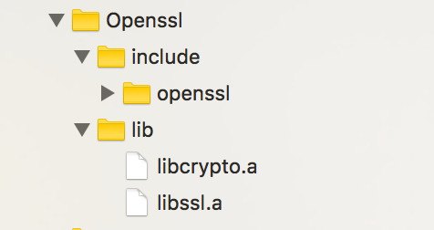
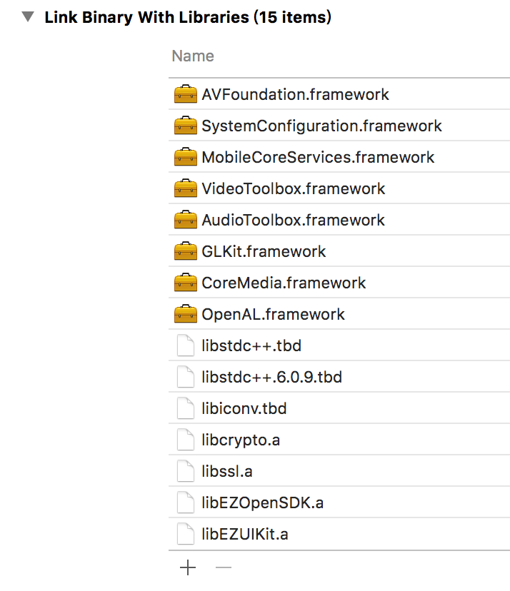

README
======
1.简介
----
UIKit，是基于萤石开放平台OpenSDK封装的UI组件，使用过程中不必学习专业的业务概念，更不用调用繁琐的接口，能够以极简的嵌入方式，快速在您的应用中集成视频功能。UIKit覆盖的平台包含：iOS、Android、H5、Web、ActiveX(IE)。

2.创建应用
-----
首先，你需要在控制面板中申请Appkey。请参考[申请Appkey]( https://open.ys7.com/view/app/app_edit.html)。

3.安装SDK
-----
下载SDK:[官方下载](https://)或者[github下载](http://)。

**1.创建一个新的XCode项目。**

**2.修改target配置项Build Settings标签下的Other Linker Flags 值为：-ObjC。如图：**

**3.导入下载包中EZUIKit文件夹下的所有库文件以及公开头文件。**

**4.导入openssl库文件以及公开头文件如图：**

**5.引入系统库如图：**

4.示例
-----
	[EZUIKit initWithAppKey:appKey];
	[EZUIKit setAccessToken:accessToken];
	self.mPlayer = [EZUIPlayer createPlayerWithUrl:url];
	self.mPlayer.mDelegate = self;
	[self.view addSubview:self.mPlayer.previewView];
	[self.mPlayer startPlay];
**1.初始化：**
设置appkey
`[EZUIKit initWithAppKey:appKey];`

**2.登录授权：**
设置access token:
`[EZUIKit setAccessToken:accessToken];`

access token获取：
使用 EZOpenSDK中的openLoginPage: 方法跳转到登录页，登录成功之后block会回调EZAccessToken对象，该对象中包含accessToken字符串;
如果是B模式对接，accessToken由开发者服务器下发，获取到accessToken后直接setAccessToken即可。

**3.创建播放器：**
根据url创建播放器对象，url为遵循[ezopen协议](https://)的字符串，self为UIViewController子类。

	self.mPlayer = [EZUIPlayer createPlayerWithUrl:url];
	self.mPlayer.mDelegate = self;
	[self.view addSubview:self.mPlayer.previewView];
**4.开始播放：**
`[self.mPlayer startPlay];`

**5.停止播放：**
`[self.mPlayer stopPlay];`
 
**更详细的使用方法，请参考下载包中example文件夹下的demo源码。**

	